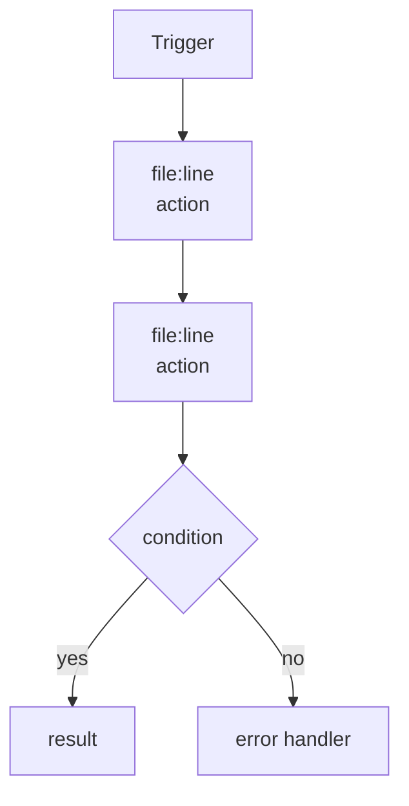
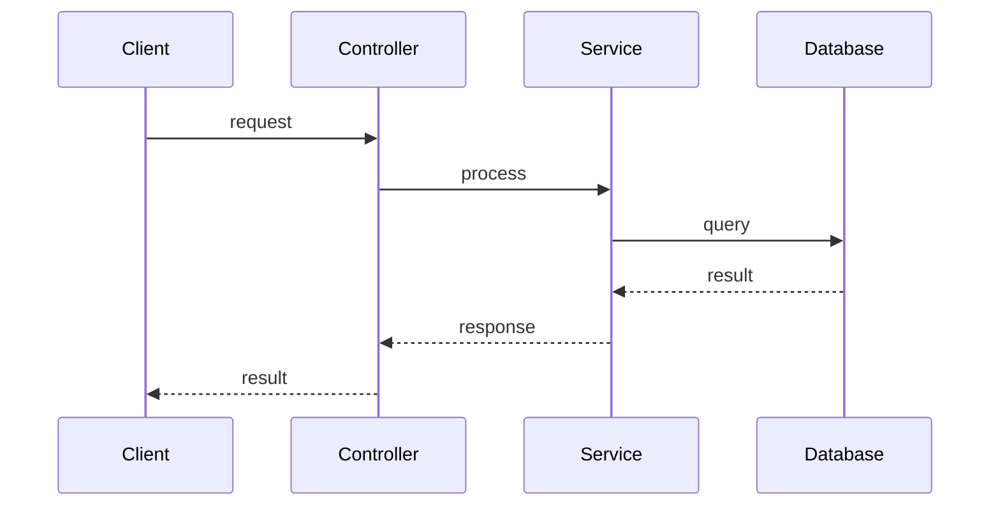

# Flow Documentation Template

## Flow: [FlowName]

### Overview
- **Type:** API/Event/Job/Startup/Middleware
- **Entry:** `file:line` - `function()`
- **Trigger:** [what starts this flow]

### Flowchart

### Sequence Diagram

### Execution Trace

#### Step 1: [Name]
- **File:** `path/file.ext`
- **Line:** X
- **Function:** `name()`
- **Action:** [what happens]
- **Next:** [next function]

#### Step 2: [Name]
- **File:** `path/file.ext`
- **Line:** X
- **Function:** `name()`
- **Action:** [what happens]
- **Next:** [next function]

### Error Handling
| Error Type | Location | Handler |
|------------|----------|---------|
| ValidationError | file:line | returns 400 |
| NotFoundError | file:line | returns 404 |

### Side Effects
- **File I/O:** [read/write operations]
- **Database:** [queries/mutations]
- **Network:** [external API calls]
- **State:** [state changes]
