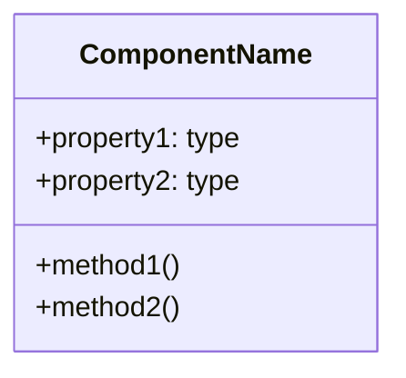

# Component Documentation Template

## [ComponentName]

### Overview
- **File:** `path/to/file.ext`
- **Type:** Class/Service/Controller/Module
- **Lines:** [start]-[end]

### Purpose
[What this component does]

### Class Diagram


### Dependencies
**Imports:**
- `module` from `source`

**Used by:**
- `OtherComponent` in `file.ext`

### Public Interface

#### Properties
| Name | Type | Description |
|------|------|-------------|
| prop | type | desc |

#### Methods

##### `methodName(param: type): returnType`
- **Purpose:** [what it does]
- **Params:** `param` - [description]
- **Returns:** [description]
- **Example:**
```
code example
```

### Internal Logic
[Key algorithms or important implementation details]

### Related Components
- [ComponentA](./ComponentA.md)
- [ComponentB](./ComponentB.md)
